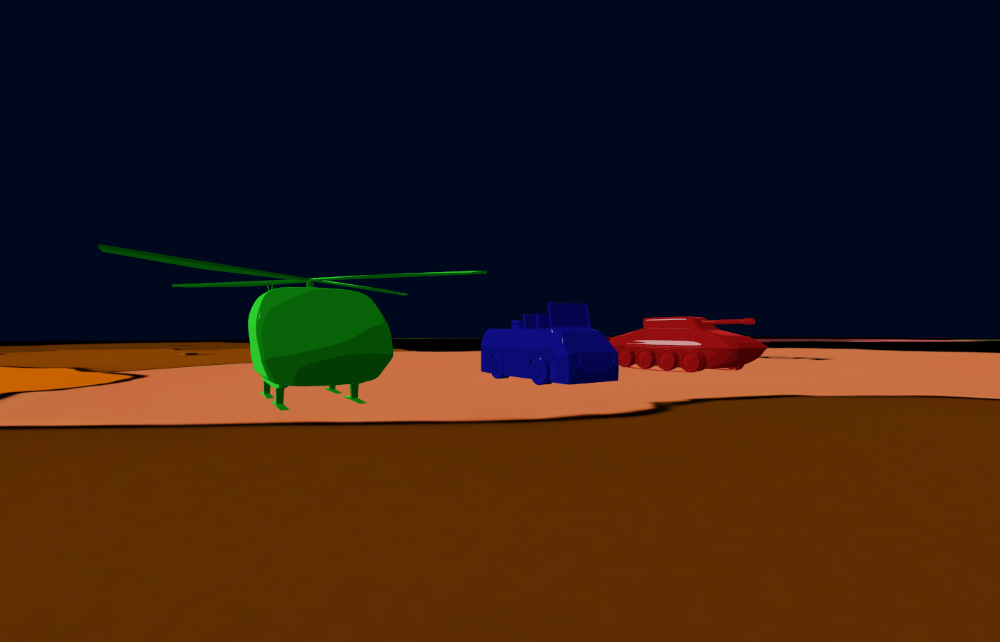
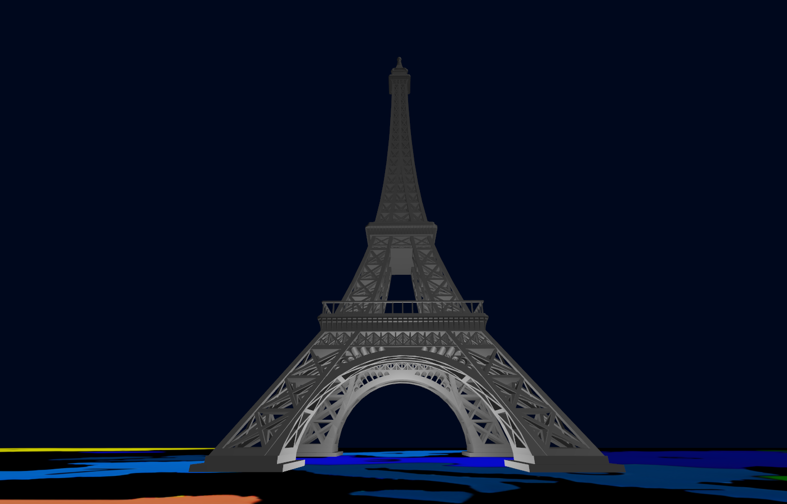
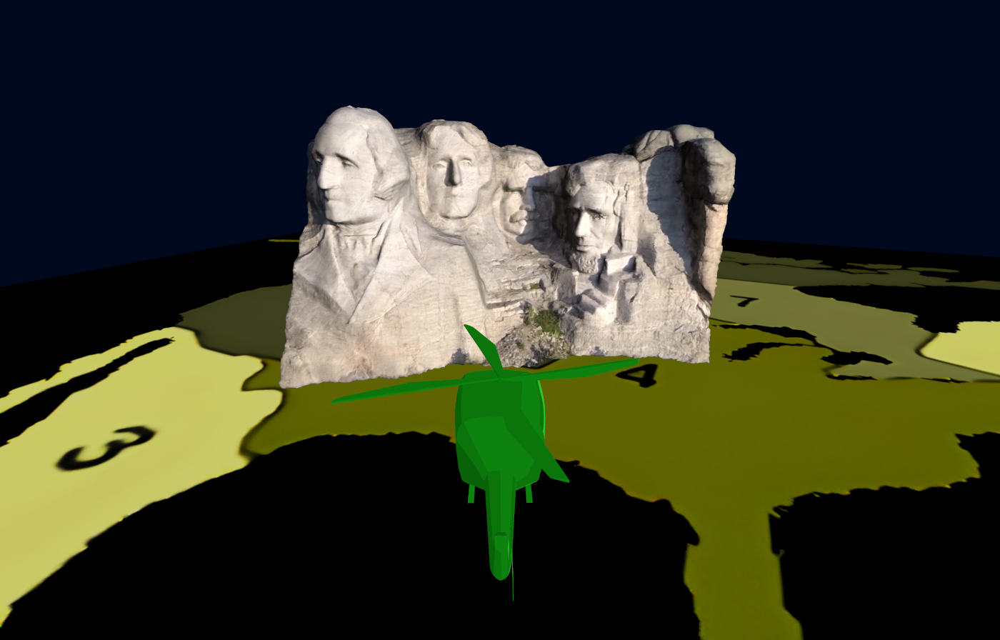

# Enhanced RiSiKo!

This project is an implementation of a geographic map that contains 3 monuments (the Tour Eiffel,
a Japanese Pagoda and the Mount Rushmore) and 3 vehicles to explore it: a tank, a car and a helicopter. This project was developed as the final part of the exam of **Computer Graphics** course.

## 📌 Features

- Both first-person and third-person view and movement;
- Real-time lighting with different shaders;
- Logic to get on and off different vehicles, each with different controls;
- Moving parts in models (helix, tires);
- Resizable window;
- Controller integration;

An extensive list with more details can be found after the screenshot part.

## 🛠 Technologies

- Visual Studio (IDE)
- A Vulkan-capable GPU (graphics card)
- Vulkan SDK (Software Development Kit)
- GLFW (a multi-platform library for OpenGL, OpenGL ES, and Vulkan)
- GLM (a C++ mathematics library for graphics software)

## 🎮 Controls:
WASD to move the player, Arrow Keys or Mouse to move the camera, E or Mouse Right Click to interact 
with vehicles, R and F to go up and down while using the helicopter. Clicking the left mouse button will make the cursor appear 
and disable the movement of the camera, to adjust the window position/scale.

## 📷 Screenshots:

Shadows are not implemented: they are part of the Mt Rushmore texture.

## 📋 Extensive list of features

Implemented features:

- 7 models: 3 handcrafted ones (the vehicles, which do have the smooth shading to obtain
  better-looking figures with their shader), 3 taken from the internet (the monuments; the Mount 
  Rushmore needed some tweaks, its number of vertices has been drastically reduced to avoid low
  frame rates, and it's the only monument that uses a texture), one created at runtime by specifying
  its vertex positions, normals and UV coordinates.

- 5 pipelines: one for the vehicles, one for each monument and one for the floor. Each pipeline has 
  its own set of shaders (except the vertex shader, which is almost identical), and uses different 
  techniques to model the light equation (diffuse and specular):
    - vehicles use Toon Shading (following and adapting this tutorial 
      https://roystan.net/articles/toon-shader/) and Blinn reflection;
    - monuments uses Cook-Torrance and Phong (different pipelines are used because every monument
      uses its own light. Also the Mount Rushmore uses a slightly different shader to get the
      color from the texture instead of taking it from a parameter from the uniform buffer);
    - floor use a basic shader that just show the texture.
  
- Models are loaded only once and used multiple times where needed (in particular the tires). 
  
- 4 ways to move around the map: walking, with a car, with a tank or with a helicopter.
  You can interact and ride a vehicle by moving near it and pressing E; after a brief visual
  transition, you can use it. Each vehicle has its own way to move: 
    - the tank can rotate while standing still and has the lowest velocity and acceleration of all vehicles.
    - the car can only turn while moving, and its tires move to the left and right based on 
      the input of the player; the tires also rotate forward or backwards based on the car's velocity.
    - the helicopter cannot move if it doesn't reach a certain height, it will follow the camera's rotation
      to stay aligned (with a certain deadzone angle and with a certain damping speed), it won't go under
      a certain height if moving and you can get off it even in the air: the gravity will make it go back 
      to the terrain height (player included). It has moving propellers that rotate and change speed based on
      the inputs and follow the helicopter's inclinations.
    - both the car's tires and the helicopter's propellers uses a series of transformations to make them rotate
      and move in certain direction based on the vehicles parameters.

## 📊 Results
The project was presented to the professor and, together with the [assignments](https://github.com/FrancescoColabene/ComputerGraphics-Assignments), obtained a final evaluation of 30.

## ©️ Credits

The monument models were taken online under the [CC Attribution License](https://creativecommons.org/licenses/by/4.0/deed.en). Credits can be found [here](AXX/models/CREDITS.md).

A special thanks goes to [Samuel](https://github.com/samuelgiunca) for the vehicles models and other adjustments to monument models. 

## 👤 Authors
The project was developed by [Francesco Colabene](https://github.com/FrancescoColabene) and [Stefano Carraro](https://github.com/StefanoCarraro7) for the **Computer Graphics** course, Polytechnic University of Milan, A.Y. 2022/2023
